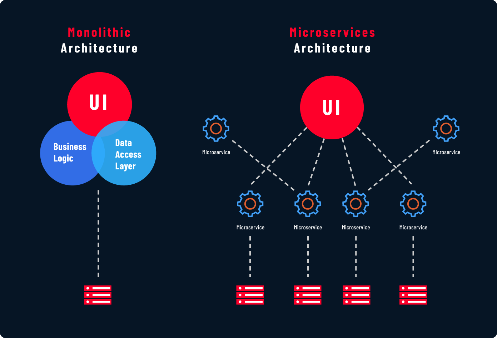

# System Design Basics

## Template

- **Client :-** A device which request information
- **Server :-** A computer that listens to client and response
- **DataBase :-** A store which stores data
- **Vertical Scaling :-** Increase system `cpu` or `ram` to handle load
- **Horizontal Scaling :-** Add more servers to handle load
- **Load Balancer :-** system component which tranfer request to the server equally
- **DB Sharding :-** Split DB into multiple DB and each store some part of data
- **DB Replication :-** Replicate DB, if one DB loss then we have copy of that
- **Cache :-** it is a quick access memory that stores info that users ask a lot
- **Content Delivery Network(CDN) :-** It stores website static content at various location
around the world

- **Monolithic Architecture :-** System perform all the oprations in a single server
- **Microservice Architecture :-** System divides the opration into small services and run on dedicated server
- **Message queue :-** system component which helps async communication b/w sender and reciever by storing messages
- **API Gateway :-** system component which transfer request to a appropiate service