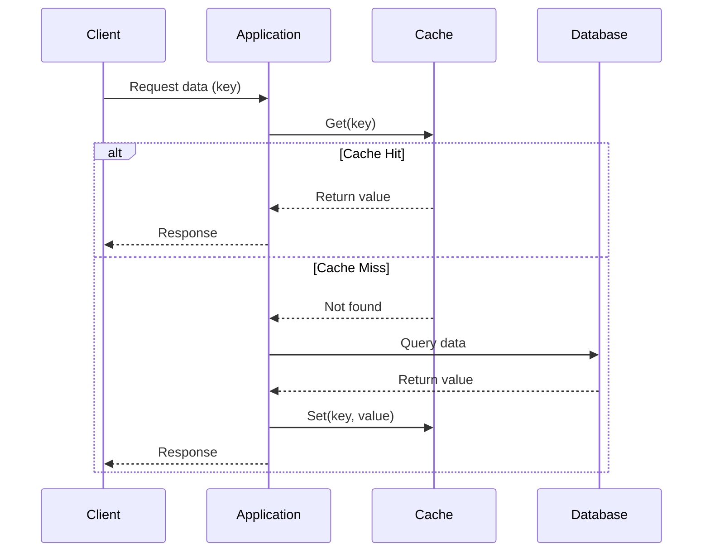
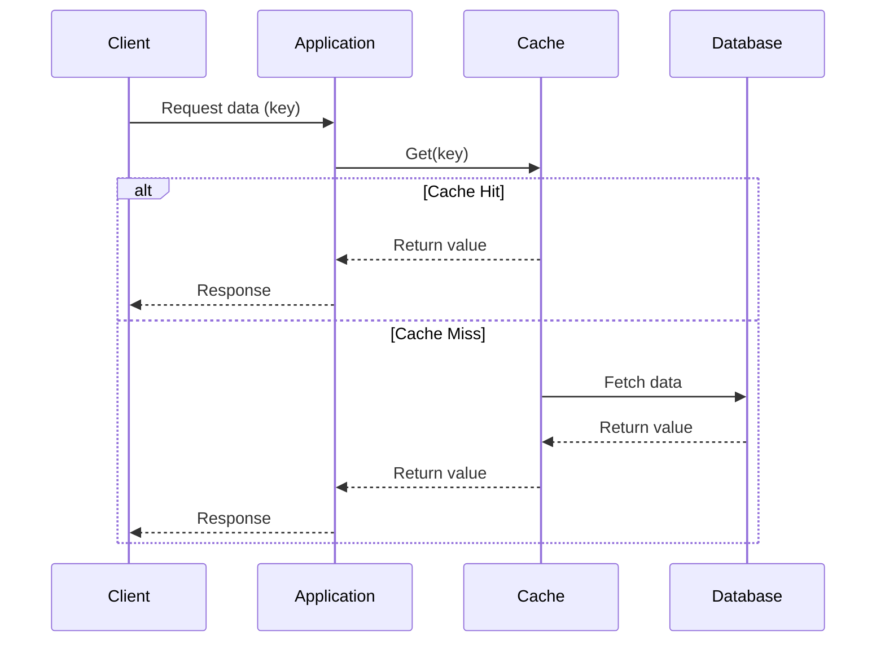

# Caching Strategies

- **Caching** is a technique that is used to speed up the data retreval, By storing frequently accessed data in a fast access cache, Rather than repeatedly quering a slow DB

## Read Stategies

### Cache Aside Strategy

- Server first check in cache for data retrieval
- if data not found, AKA a cache miss
- then server retrieve from DB
- and store in cache too

- **PROs :-** 
    - Increace Fault Tolerance
        - If cache service is down, server directly use DB
    - Flexible Schemas
        - sever handles cache service, so it stores as per the need
- **CONs :-**
    - Stale Data
        - DB data change
        - we have to do cache validation periodically
        - remove corupt data
---

---

### Read Through Strategy

The cache itself responsible for fetching data, if it is not already present

- cache check if data is available
- if not, cache itself fetch data from DB and save it for future request

- **PROs :-** 
    - No Stale Data
- **CONs :-**
    - cache service failuare can cause a downtime
    - less flexible
---

---
## Write Strategies

### Write Aside Strategy

- data is directly write to DB
- it update cache with read strategy
- cache updates reactively
- Also called as `Lazy Caching`

- **PROs :-** 
    - Faster write
    - cache independence
- **CONs :-**
    - Slower read
        - highy chance of cache miss
    - Risk of Stale data
---

### Write Through Strategy

- similar to `Read Through Strategy`
- data is pass and written in cache
- cache pass data and written in DB
- the db response to cache
- cache response to server

- **PROs :-** 
    - No stale data
    - fast read
- **CONs :-**
    - slow write
    - cache dependency

---

### Write Behind Strategy

- similar to `Write Through Strategy`
- data is pass and written in cache
- cache send response to servers
- cache asyncly update db

- **PROs :-** 
    - No stale data
    - fast read
    - fast write
- **CONs :-**
    - cache dependency
    - Risk data loss

---
