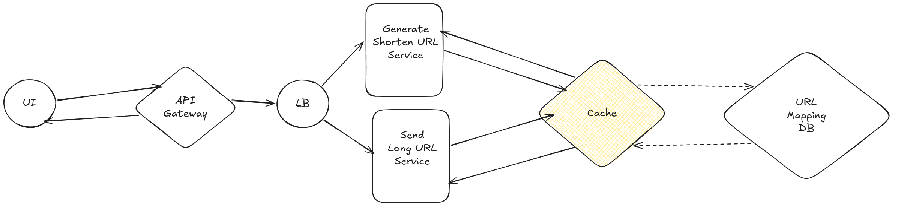

# Tiny URL

## Functionality Requirement
1. Shorten URL
2. Redirect to Original URL

## Non-Functional Requirement
1. Availability **(99.999999%)**
2. Low Latency
3. Scalability

## Capacity Estimation
1. **DAU -** 300M
2. **MAU -** 1B
3. **Throughput**
    - **Write (Assume, 10 out of 100 user shorten 5 URL in a day)** `150M shorten URL Request/Day`
    - **Read (Assume, 1 user click on 20 shortened URL in a day)** `6B read Req/Day`
4. **Storage -** Assume avg size of URL `200 bytes`
    - 150M * 200 bytes = `30GB/Day`
    - 10 years = `109 TB`
5. **Memory -** Assume  we store all shortened URL in a day in memory for low latency
    - `30GB`
6. **Network Bandwith**
    1. **Ingress -** 
        - 30GB/Day write request in a day
        - `350 KB/sec`
    2. **Egress -** 
        - 6B Req/Day * 200 bytes = `1.2 PB/Day`
        - `14 TB/sec`
## API Design
### Shorten URL API
1. User request to shorten a URL
2. Server generate a unique short URL and store the mapping of short URL and original URL in database
3. Server return the short URL to user
#### Shorten URL API
- **Endpoint -** POST /v1/shorten
- **Body**
```
{
    originalUrl   string
}
```
### Redirect to Original URL API
1. User click on short URL
2. Server receive the request and extract the short URL from the request
3. Server query the database to get the original URL from the short URL
4. Server redirect the user to the original URL
#### Redirect to Original URL API
- **Endpoint -** GET /v1/redirect/{shortUrl}

## Collision Handling
1. If the generated short URL already exists in the database, we can generate a new short URL until we get a unique one. This can be done by appending a random string to the short URL or by using a different hashing algorithm.
2. We can also use a counter to generate unique short URLs. For example, we can use a counter that increments every time a new URL is shortened. The short URL can be generated by encoding the counter value in a base62 format (using digits, lowercase letters, and uppercase letters). This way, we can ensure that all short URLs are unique without the need for collision handling. Using Zookeeper or Redis can help us to maintain the counter value in a distributed environment and ensure that it is consistent across all servers.
3. We can also use a combination of the original URL and a random string to generate the short URL. This way, even if two users shorten the same original URL, they will get different short URLs due to the random string.

## HLA (High-Level Architecture)



## DB Selection
1. **URL Mapping db** NoSQL

## DB Modeling
1. **URL Mapping db**
```
{
    shortUrl: string,
    originalUrl: string,
    createdAt: timestamp
}
```
## Deep Dive
1. **URL Shortening Algorithm**
    - We can use a hashing algorithm like MD5 or SHA-256 to generate a unique short URL from the original URL. However, these algorithms can produce long hashes, which may not be suitable for a URL shortener. Instead, we can use a base62 encoding to generate a shorter URL. Base62 encoding uses digits (0-9), lowercase letters (a-z), and uppercase letters (A-Z) to represent the encoded value. This allows us to generate a short URL that is more user-friendly and easier to share.
2. **URL Redirection**
    - When a user clicks on a short URL, the server needs to redirect the user to the original URL. This can be done using an HTTP 301 (Moved Permanently) or HTTP 302 (Found) status code. The server will look up the short URL in the database to find the corresponding original URL and then send a redirect response to the user's browser.