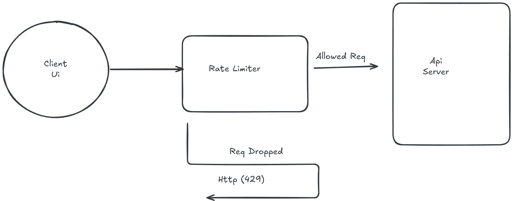
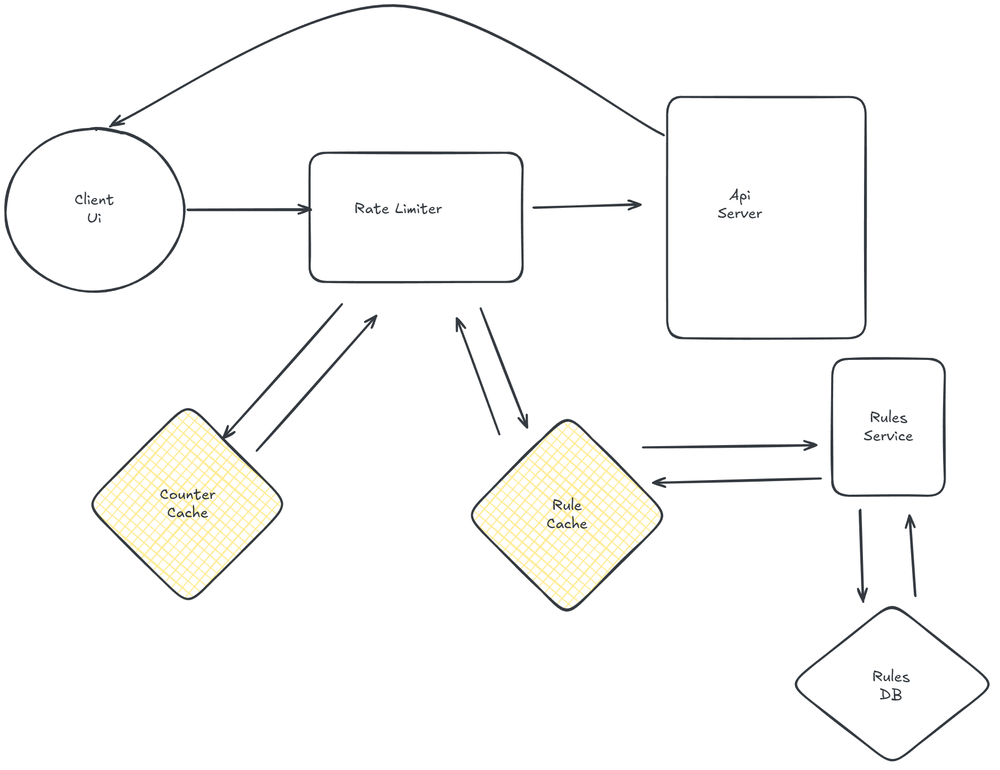

# Rate Limiter

A rate limiter is a mechanism that controls the rate at which a particular action can be performed. such as API server, to prevent the requests from exceeding a certain limit on specific time period.

## Functional Requirements
1. Restritct the request or manage the request
    - Based on IP address
    - Based on User ID
    - Based on Device ID
    - Based on API key
2. User notification when the request limit is exceeded

## Non-Functional Requirements
1. High Availability **(99.9999999%)**
2. Low Latency
3. Scalability
4. Cost Efficiency

## Capacity Estimation
1. **DAU -** 500M
2. **MAU -** 2B
3. **Throughput -** Assume, each user makes 100 requests in a day
    - `50B Req/Day`
4. **Storage & Memory -** Assume we store the request count for each api used by each user in a day and each record takes 100 bytes
    - 1 user uses 50 different API in a day and each record takes 100 bytes, then for 500M DAU, we need to store `50B records/Day`
    - 50B records/Day * 100 bytes = `2.5 TB/Day`
    - **Note -** limit will usally reset after a certain time period, so we can delete the old records and only keep the current records in memory for low latency
5. **Network Bandwidth -** Assume each request takes 1 KB of data
    - 50B Req/Day * 1 KB = `50 TB/Day`
    - `150 MB/sec`

## Placement of Rate Limiter
1. Place it before the API server
    - **Pro**
        - Enhance Security
        - Reduce Load on API Server
    - **Con**
        - Increase Latency
        - Single Point of Failure
2. Place it with the API server
    - **Pro**
        - Reduce Latency
        - Granular Control
        - No Single Point of Failure
    - **Con**
        - Increase Load on API Server
        - Security Risk

## HLD

### Basic Flow


- Client sends a request to API server
- Before Hitting the API server, the request goes through the rate limiter
- Rate limiter checks the request count for the user and API in the current time window
- If the request count exceeds the limit, the rate limiter returns an error response to the client with appropriate status code (e.g., 429 Too Many Requests)
- If the request count is within the limit, the rate limiter allows the request to proceed to the API server

### Storing Request Count and Rules
1. We use cache (e.g., Redis) to store the request count for each user and API in the current time window for low latency access.
2. We can use a database to store the rate limiting rules and configurations. And cache the rules in memory for fast access by the rate limiter.


## DB Selection
1. **Cache -** Redis
    - In-memory data store for low latency access to request counts
2. **Rules DB** SQL Database

## DB Modeling
1. **Rule DB**
```
{
    ruleId: string,
    apiType: string,
    limit: int,
    timeWindow: int
}
```

2. **Request Count Cache**
```
{
    userId: string,
    apiType: string,
    requestCount: int,
    timeWindowStart: timestamp
}
```

## Deep Dive
Implemented using 5 Algorithms
1. **Token Bucket**
2. **Leaky Bucket**
3. **Fixed Window Counter**
4. **Sliding Window Log**
5. **Sliding Window Counter**

### Token Bucket Algorithm
1. Each user and API has a bucket that can hold a certain number of tokens (the limit).
2. Tokens are added to the bucket at a fixed rate (e.g., 1 token per second).
3. For each request made by the user for the API, a token is removed from the bucket.
4. If the bucket is empty (i.e., no tokens are available), the request is rejected until a token is added to the bucket.

* **Pros:**
    - Allows for bursts of traffic up to the bucket size
    - Simple to implement and understand

* **Cons:**
    - Can be complex choosing the right bucket size and token refill rate

### Leaky Bucket Algorithm
1. Each user and API has a bucket that can hold a certain number of requests (the limit).
2. Requests are added to the bucket as they arrive.
3. The bucket leaks at a constant rate (e.g., 1 request per second).
4. If the bucket is full (i.e., the number of requests in the bucket exceeds the limit), incoming requests are rejected until there is space in the bucket.

* **Pros:**
    - Smooths out bursts of traffic
    - Simple to implement and understand

* **Cons:**
    - Can introduce latency for requests during high traffic

### Fixed Window Counter Algorithm
1. Each user and API has a counter that tracks the number of requests made in a fixed time window (e.g., 1 minute).
2. When a request is made, the counter is incremented.
3. If the counter exceeds the limit within the time window, subsequent requests are rejected until the time window resets.

* **Pros:**
    - Simple to implement and understand
    - Efficient for low traffic scenarios

* **Cons:**
    - Can lead to burstiness at the edges of time windows
    - Not suitable for high traffic scenarios

### Sliding Window Log Algorithm
1. Each user and API has a log that records the timestamps of each request.
2. When a request is made, the log is updated with the current timestamp.
3. We remove timestamps from the log that are older than the current time minus the time window (e.g., 1 minute).
4. To check if a request should be allowed, the log is checked for the number of requests made in the last time window (e.g., 1 minute).
5. If the number of requests in the log exceeds the limit, the request is rejected.

* **Pros:**
    - Provides accurate rate limiting
    - Handles bursty traffic well

* **Cons:**
    - Can consume more memory for storing logs
    - Slightly more complex to implement compared to fixed window counter
    - Costly to maintain logs for high traffic scenarios

### Sliding Window Counter Algorithm
1. Each user and API has a counter that tracks the number of requests made in a sliding time window (e.g., 1 minute).
2. When a request is made, the counter is incremented.
3. We also maintain a timestamp of the last request made.
4. To check if a request should be allowed, we calculate the time difference between the current time and the timestamp of the last request.
5. If the time difference is greater than the time window, we reset the counter and allow the request.
6. If the time difference is within the time window, we check if the counter exceeds the limit. If it does, the request is rejected; otherwise, it is allowed.

```
calculate allowed Request = ((overlaped previous window/ total previous window) * previous window req count) + current window count
```

* **Pros:**
    - Provides accurate rate limiting
    - Handles bursty traffic well
    - More memory efficient than sliding window log

* **Cons:**
    - Slightly more complex to implement
    - Can be less accurate than sliding window log in certain scenarios

### Race Condition Handling
1. To handle race conditions when multiple requests are made simultaneously for the same user and API, we can use distributed locks (e.g., Redis locks) to ensure that only one request can update the request count for a user and API at a time.