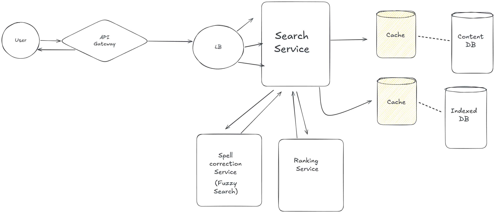

# Search System

## Functional Requirements
1. Search for content based on keywords, hashtags, or user mentions.
2. Data displayed in a ranked order based on relevance and recency.
3. Fuzzy Search for handling typos and approximate matches.

## Non-Functional Requirements
1. High Availability (99.999999%)
2. Low Latency
3. Scalability

## Capacity Estimation
1. **DAU (Daily Active Users)** - 100M users
2. **MAU (Monthly Active Users)** - 500M unique users
3. **Throughput**
   - **Read -:**
        - Assume each user performs 5 searches per day, resulting in `500M searches/day`, thus `5.8K searches/second`.
4. **Storage**
    - Assume the average size of a content item is 200 bytes, so 100M users * 200 bytes = `20GB/day`.
    - For 10 years, total storage required = `20GB/day * 365 days/year * 10 years = 73TB`.
5. **Memory**
    - Assume we store 5% of content in memory for low latency access, resulting in `1GB/day`.
6. **Network Bandwidth**
    - **Ingress -:**
         - 20GB/day will be stored in the database, so `231MB/s` of ingress traffic.
    - **Egress -:**
         - 500M searches/day * 10 records/search * 200 bytes = `1TB/day`, so `11.6GB/s` of egress traffic.

## API Design
### Search API 
1. User sends a search query to the server.
2. Server processes the query and retrieves relevant content from the database.
3. Server ranks the results based on relevance and recency.
- **Endpoint -** GET /v1/search
- **Query Parameters**
```
{
    query: string, // search query with url encoded
    limit: number, // number of results to return
    offset: number, // pagination offset
}
```
- **Response**
```
{
    results: [
        {
            contentId: string,
            contentType: string, // text, image, video, etc.
            content: string, // content or URL for multimedia content
            relevanceScore: number,
            timestamp: string, // ISO 8601 format
        },
        ...
    ],
    totalResults: number,
}
```

## High-Level Design


## DB Selection
1. **Content DB** -> NoSQL database (e.g., MongoDB, Cassandra) for storing content items with flexible schema.

## Data Model
### Content Item
```
{
    contentId: string, // unique identifier for the content
    contentType: string, // text, image, video, etc.
    content: string, // content or URL for multimedia content
    hashtags: [string], // list of hashtags associated with the content
    mentions: [string], // list of user mentions associated with the content
    timestamp: string, // ISO 8601 format
}
```
### Indexing
1. **Inverted Index** -> For efficient keyword search, we will maintain an inverted index
   - **Structure**
   ```
   {
       keyword: {
           contentIds: [string], // list of content IDs containing the keyword
           lastUpdated: string, // timestamp of the last update to the index
       },
       ...
   }
   ```

## Deep Dive
### Query Correction Service
1. **Purpose**: To handle typos and approximate matches in user queries.
2. **Implementation**:
    - Use a spell-checking library or implement a custom algorithm (e.g., Levenshtein distance) to suggest corrections for misspelled words.
    - Maintain a dictionary of common words and phrases to improve correction accuracy.
    - Integrate the query correction service with the search API to provide real-time suggestions to users.
### Elasticsearch
1. **Purpose**: To provide full-text search capabilities and handle complex queries efficiently.
2. **Implementation**:
    - Set up an Elasticsearch cluster to index content items and support search queries.
    - Configure analyzers and tokenizers to handle different content types (e.g., text, hashtags, mentions).
    - Use Elasticsearch's built-in ranking algorithms to sort search results based on relevance and recency.