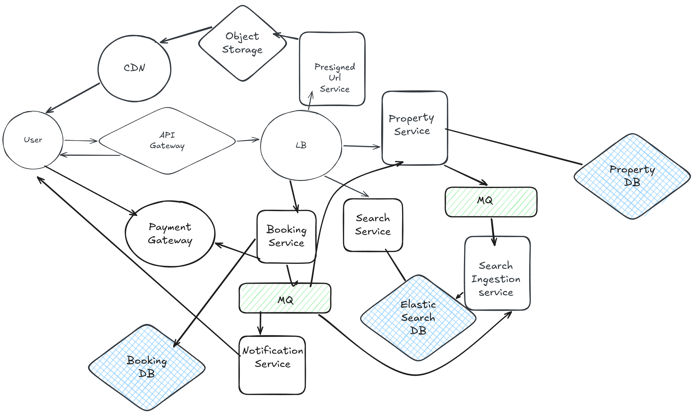

# Airbnb System Design

## Functional Requirements
### Property Owners
1. Add, update or delete property.
2. View bookings

### Guests
1. Search for properties.
2. View property details.
3. Book a property.
4. View booking history.

## Non-Functional Requirements
1. High Availability (99.9999%)
2. Low Latency
3. Strong Consistency

## Capacity Estimation
1. **DAU (Daily Active Users)** - 10M users
2. **MAU (Monthly Active Users)** - 100M unique users
3. **Throughput**
   - **Read -:**
        - Assume each user performs 10 searches per day, resulting in `100M searches/day`, thus `1.15K searches/second`.
   - **Write -:**
        - Assume each user makes 1 booking per week, resulting in `1.43M writes/day`, thus `23.8 bookings/second`.

4. **Storage**
    - Assume the average size of a property listing is 10KB, and 0.1% of users are property owners, so 100M users * 0.1% * 10KB = `10GB/day`.
    - For 10 years, total storage required = `10GB/day * 365 days/year * 10 years = 36.5TB`.

5. **Memory**
    - Assume we store 5% of property listings in memory for low latency access, resulting in `0.5GB/day`.
6. **Network Bandwidth**
    - **Ingress -:**
         - 10GB/day will be stored in the database, so `115MB/s` of ingress traffic.
    - **Egress -:**
         - 100M searches/day * 10 records/search * 10KB = `10TB/day`, so `115.7GB/s` of egress traffic.

## API Design
### Add Property API
1. **Endpoint:** `POST  api/v1/properties`
2. **Request Body:**
```json
{
    "ownerId": "string",
    "title": "string",
    "description": "string",
    "location": {
        "address": "string",
        "city": "string",
        "state": "string",
        "country": "string",
        "zipCode": "string"
    },
    "price": "number",
    "availability": [
        {
            "startDate": "string", // ISO 8601 format
            "endDate": "string" // ISO 8601 format
        }
    ],
    "images": ["string"], // URLs of property images
    "amenities": ["string"] // List of amenities
}
```

### Update Property API
1. **Endpoint:** `PUT  api/v1/properties/{propertyId}`
2. **Request Body:**
```json
{
    "title": "string",
    "description": "string",
    "location": {
        "address": "string",
        "city": "string",
        "state": "string",
        "country": "string",
        "zipCode": "string"
    },
    "price": "number",
    "availability": [
        {
            "startDate": "string", // ISO 8601 format
            "endDate": "string" // ISO 8601 format
        }
    ],
    "images": ["string"], // URLs of property images
    "amenities": ["string"] // List of amenities
}
```

### View Property Bookings API
1. **Endpoint:** `GET  api/v1/properties/{propertyId}/bookings`
2. **Response:**
```json
{
    "bookings": [
        {
            "bookingId": "string",
            "guestId": "string",
            "startDate": "string", // ISO 8601 format
            "endDate": "string", // ISO 8601 format
            "status": "string" // confirmed, cancelled, etc.
        }
    ]
}
```
### Search Properties API
1. **Endpoint:** `GET  api/v1/properties/search`
2. **Query Parameters:**
```json
{
    "location": "string", // city or zip code
    "startDate": "string", // ISO 8601 format
    "endDate": "string", // ISO 8601 format
    "priceRange": {
        "min": "number",
        "max": "number"
    },
    "amenities": ["string"], // List of required amenities
    "limit": "number", // number of results to return
    "offset": "number" // pagination offset
}
```
3. **Response:**
```json
{
    "results": [
        {
            "propertyId": "string",
            "title": "string",
            "description": "string",
            "price": "number",
            "availability": [
                {
                    "startDate": "string", // ISO 8601 format
                    "endDate": "string" // ISO 8601 format
                }
            ],
            "images": ["string"], // URLs of property images
        }
    ],
    "totalResults": "number"
}
```

### View Property Details API
1. **Endpoint:** `GET  api/v1/properties/{propertyId}`
2. **Response:**
```json
{
    "propertyId": "string",
    "title": "string",
    "description": "string",
    "location": {   
        "address": "string",
        "city": "string",
        "state": "string",
        "country": "string",
        "zipCode": "string"
    },
    "price": "number",
    "availability": [
        {
            "startDate": "string", // ISO 8601 format
            "endDate": "string" // ISO 8601 format
        }
    ],
    "images": ["string"], // URLs of property images
    "amenities": ["string"] // List of amenities
}
```

### Book Property API
1. **Endpoint:** `POST  api/v1/properties/{propertyId}/book`
2. **Request Body:**
```json
{
    "guestId": "string",
    "startDate": "string", // ISO 8601 format
    "endDate": "string" // ISO 8601 format
}
```
3. **Response:**
```json
{
    "bookingId": "string",
    "status": "string" // confirmed, pending, cancelled, etc.
}
```

## HLD


## DB Selection
1. **Property DB** -> NoSQL database (e.g., MongoDB, Cassandra)
2. **Booking DB** -> SQL database (e.g., PostgreSQL, MySQL) for transactional consistency

## Data Model
### Property DB
```json
{
    "propertyId": "string", // unique identifier for the property
    "ownerId": "string", // unique identifier for the property owner
    "title": "string",
    "description": "string",
    "location": {
        "address": "string",
        "city": "string",
        "state": "string",
        "country": "string",
        "zipCode": "string"
    },
    "price": "number",
    "availability": [
        {
            "startDate": "string", // ISO 8601 format
            "endDate": "string" // ISO 8601 format
        }
    ],
    "images": ["string"], // URLs of property images
    "amenities": ["string"] // List of amenities
}
```
### Booking DB
```json
{
    "bookingId": "string", // unique identifier for the booking
    "propertyId": "string", // unique identifier for the property
    "guestId": "string", // unique identifier for the guest
    "startDate": "string", // ISO 8601 format
    "endDate": "string", // ISO 8601 format
    "totalPrice": "number", // total price for the booking
    "status": "string", // confirmed, pending, cancelled, etc.
    "transactionId": "string" // unique identifier for the payment transaction
}
```

## Deep Dive
### Concurrent Booking Handling
1. **Optimistic Locking** -> Use versioning to handle concurrent updates to property availability
2. **Pessimistic Locking** -> Lock the property record during the booking process to prevent other bookings