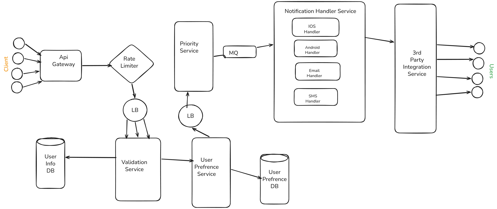

# Notification System Design

## Functional Requirements
1. Send Notifications (Email, SMS, Push)
2. Rate Limit Notifications
3. Prioritization and Validation of Notifications
4. User Preferences for Notifications

## Non-Functional Requirements
1. High Availability (99.99999%)
2. Low Latency
3. Scalability
4. Reliability
5. Flexibility

## Capacity Estimation
1. **DAU (Daily Active Users)** - 50M users
2. **MAU (Monthly Active Users)** - 400M unique users
3. **Throughput**
   - **Write -:**
        - Assume we have `1000` clients and each client sends `50K notifications/day`, resulting in `50M writes/day`, thus `578 notifications/second`.
    - **Read -:**
        - There is no read requirement for this system.
4. **Storage**
    - Assume Notification Data
        - SMS - `30%` with an average size of `500 bytes`
        - Email - `40%` with an average size of `5 KB`
        - Push - `30%` with an average size of `1 KB`
    - Assume for `50 M notifications/day`, the total storage required per day = `50M * (0.3 * 500 + 0.4 * 5K + 0.3 * 1K) = 50M * (150 + 2000 + 300) = 50M * 2450 bytes = 122.5 GB/day`.
    - For 10 years, total storage required = `122.5 GB/day * 365 days/year * 10 years = 447.125 TB`.
5. **Memory**
    - Assume we store `5%` of notifications in memory for low latency access, resulting in `6.125 GB/day`.
6. **Network Bandwidth**
    - **Ingress -:**
         - We are storing `122.5 GB/day` in the database, so `1.41 MB/s` of ingress traffic.
    - **Egress -:**
         - Assume `80%` of notifications are delivered successfully, resulting in `142.5 GB/day * 0.8 = 114 GB/day` of egress traffic, so `1.32 MB/s` of egress traffic.

## API Design
### Send Notification API
1. **Endpoint:** `POST  api/v1/notifications`
2. **Request Body:**
```json
{
    "userId": "string",
    "clientId": "string",
    "notificationType": "string", // SMS, Email, Push
    "message": "string",
    "priority": "string", // High, Medium, Low
    "timestamp": "string" // ISO 8601 format
}
```
3. **Response Body:**
```json
{
    "notificationId": "string",
    "status": "string", // Sent, Failed, Queued
    "timestamp": "string" // ISO 8601 format
}
```

## High-Level Design


## DB Selection
1. **User Info DB:** SQL
2. **User Preferences DB:** NoSQL

## Data Modeling
### User Info DB
1. **Table Name:** Users
2. **Columns:**
   - userId (Primary Key)
   - name
   - email
   - phoneNumber
   - isActive
   - createdAt
   - updatedAt

### User Preferences DB
1. **Collection Name:** UserPreferences
2. **Fields:**
   - userId (Primary Key)
   - notificationType (SMS, Email, Push)
   - isEnabled (boolean)
   - ServiceType (Promotional, Transactional, etc.)
   
