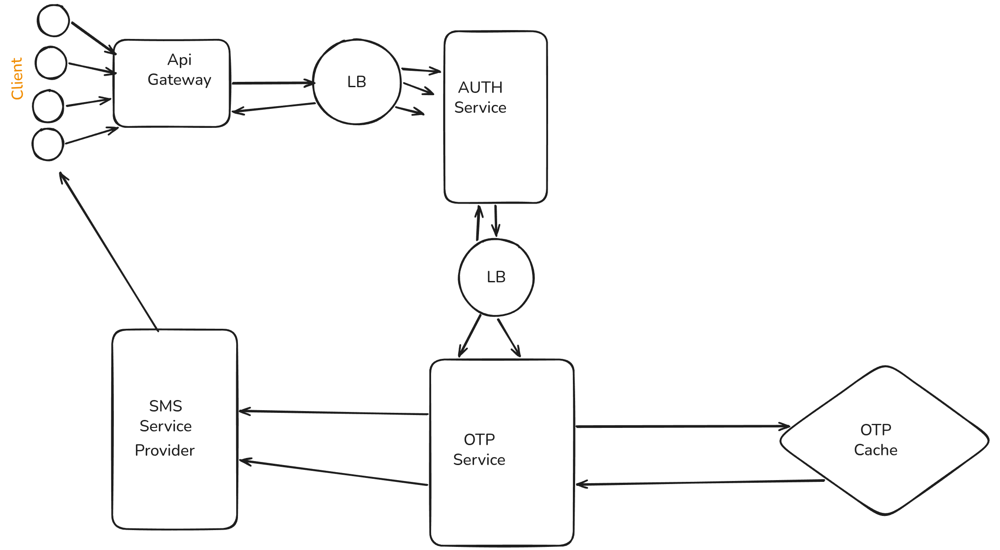

# Design OTP Service

## Functional Requirements
1. Generate OTP
2. Validate OTP
3. Rate limit OTP generation and validation
4. Expire OTP

## Non-Functional Requirements
1. High availability `(99.99999% uptime)`
2. Low latency
3. Scalability

## Capacity Estimation

### DAU
- 100M
### MAU
- 500M
### Throughput
#### Write Throughput
- 1 user ask 1 OTP per day
- Throughput per second = 100M / (24 * 60 * 60) ≈ 1157 OTPs requests per second

#### Read Throughput
- Assuming each OTP validation is a read operation
- 1 user validates 1 OTP per day and 20% user retry upto 3 times
- Throughput per user per day = 1 + 0.2 * 3 = 1.6 OTP validation requests per day
- total read = 100M req/day
- total retry = 100M * 0.2 * 3 = 60M OTP validation requests per day
- total read including retry = 100M + 60M = 160M OTP validation requests per day
- Throughput per second = 160M / (24 * 60 * 60) ≈ 1852 OTP validation requests per second

### Storage Estimation
- For OTP storage we do not need database, it can take memory like cache (e.g., Redis)
- Assumev each OTP record requires 100 bytes of storage
- Total storage per day = 100M * 100 bytes = 10GB


### Network Estimation
#### Egress Traffic Estimation
- Assuming each OTP request and validation response is 1KB
- Total egress per day = (100M OTP requests + 160M OTP validation requests) * 1KB ≈ 260GB
- Total egress per second = 260GB / (24 * 60 * 60) ≈ 3MB/s
#### Ingress Traffic Estimation
- Assuming each OTP request and validation request is 1KB
- Total ingress per day = (100M OTP requests + 160M OTP validation requests) * 1KB ≈ 260GB
- Total ingress per second = 260GB / (24 * 60 * 60) ≈ 3MB/s

## API Design
### Generate OTP
- **Endpoint:** `POST /v1/generate-otp`
- **Request Body:**
  ```json
  {
    "user_id": "string",
    "phone_number": "string",
    "challengeId": "string"
  }
  ```
- **Response:**
  ```json
  {
    "challengeId": "string"
  }
  ```

### Validate OTP
- **Endpoint:** `POST /v1/validate-otp`
- **Request Body:**
  ```json
  {
    "otp_code": "string",
    "challengeId": "string"
  }
  ```
- **Response:**
  ```json
  {
    "is_valid": "boolean"
  }
  ```

## System Design


## Database Design
### OTP Table
```
{
    "challengeId": "string",
    "user_id": "string",
    "phone_number": "string",
    "otp_code": "string",
    "expires_at": "timestamp"
}
```
